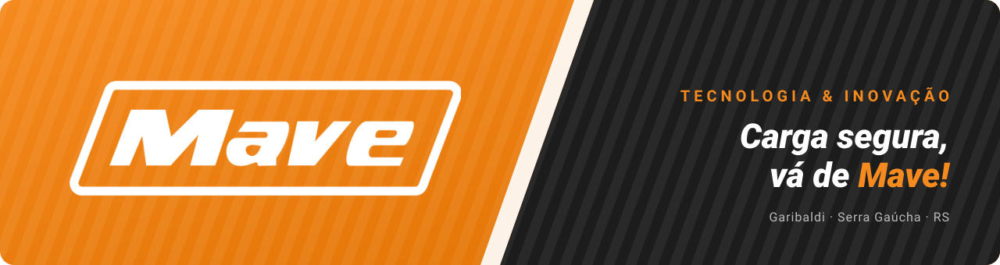
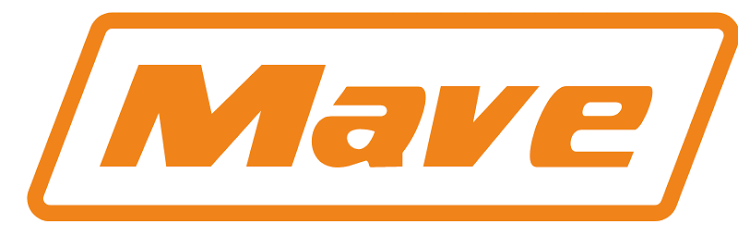

  

  
  
  
  

## Sobre a Mave

A **Mave** é especializada em acessórios de segurança para cargas: amarração, elevação e movimentação, para caminhões, utilitários e motos. Fica em **Garibaldi, na Serra Gaúcha (RS)**, e entrega para todo o Brasil.

Este é o perfil do time de **Tecnologia & Inovação** da Mave, onde ficam os sistemas internos, automações e ferramentas que a gente desenvolve para o dia a dia da empresa.

<table>
  <tr>
    <td align="center" width="25%"><b>Maior fabricante</b> de extensores do Brasil</td>
    <td align="center" width="25%"><b>Produção nacional</b> feito no Brasil</td>
    <td align="center" width="25%"><b>Entrega 100%</b> em todo o território nacional</td>
    <td align="center" width="25%"><b>Fazer a diferença</b> o nosso propósito</td>
  </tr>
</table>

## Linhas de produtos

| Linha | O que tem |
|---|---|
| **Amarração** | Cintas, catracas, ganchos, extensores elásticos e redes de contenção |
| **Mave Pro** | Linha premium de amarração, com maleta |
| **Elevação** | Cintas para elevação de cargas |
| **Movimentação** | Carrinhos para movimentação de cargas |
| **Acessórios para caminhão** | Cabos de aço, pinos de carroceria e lonas |
| **Mave EPIs** | Luvas de trabalho |

## Stack do time

  
  
  
  
  

---

   
  <b>Carga segura, vá de Mave!</b> Rodovia RSC 453, km 91, nº 950 · Garibaldi/RS · (54) 3464-1041

